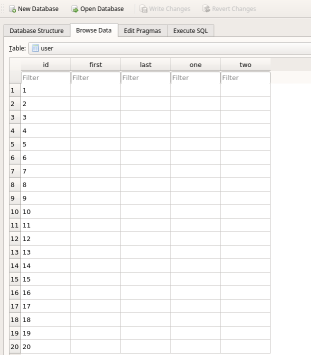
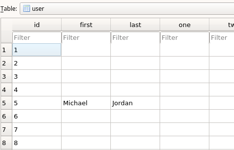

### What is this?
* This is a demonstration of how to update content in a database using Flask and SQLAlchemy
* We will be generating some blank data into our database.
* Url routes and starting the test server code and all the other Flask good stuff is excluded, this is so we only focus on the "Update" portion in 'CRUD'  
___
### How to use?
* The first commented out line at the bottom will create and generate 20 rows blank data into our "example.db" database file. Comment out this line after you run once.
* Run this only once, as any subsequent runs will insert another 20 blank rows.
* Open up a SQLite database browser and open up the generated .db file.
* It should look something like this:

* Now comment the generate() line and uncomment the 2 lines below it.
* You'll notice each of those functions could exist on their own, but it may appear messy as your fields and number of tables grow. To prevent confusion, this is a nice way to organize your tables with class namespaces.
* Run the following lines. The first argument refers to the unique identifier of each row and depending on what you want to change is as easy as refering to it by its field name.

* Instanciate and use with instance. Or i guess you could make this a @staticmethod
* edit = EditUser()
* edit.first(5, 'Michael')
* edit.last(5, 'Jordan')
* Refresh the database and you should see:

